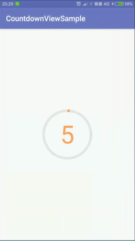

# CountdownView

这是新项目中用到的一个倒计时控件，可以通过addView(...)添加到任意布局中。计时长短可调；各种颜色、尺寸可调；可以传入一个监听器，当计时结束时会得到通知。

效果：



基本用法：

```java
FrameLayout fl_container = findViewById(R.id.fl_container);

//第2个参数为倒计时时长
CountdownView countdownView = new CountdownView(this, 5, new CountdownView.Listener() {
    @Override
    public void onFinished() {
        Toast.makeText(MainActivity.this, "计时结束", Toast.LENGTH_SHORT).show();
    }
});

fl_container.addView(countdownView);
```

改变各种参数：

```java
CountdownView countdownView = new CountdownView(this, 20, listener)
    .setSize(400, 400)//控件尺寸
    .setStrokeWidth(20)//线宽
    .setTextsize(200)//文字尺寸
    .setColor(backgroundColor, forgroundColor, textColor);//背景色、前景色、文字颜色
```
